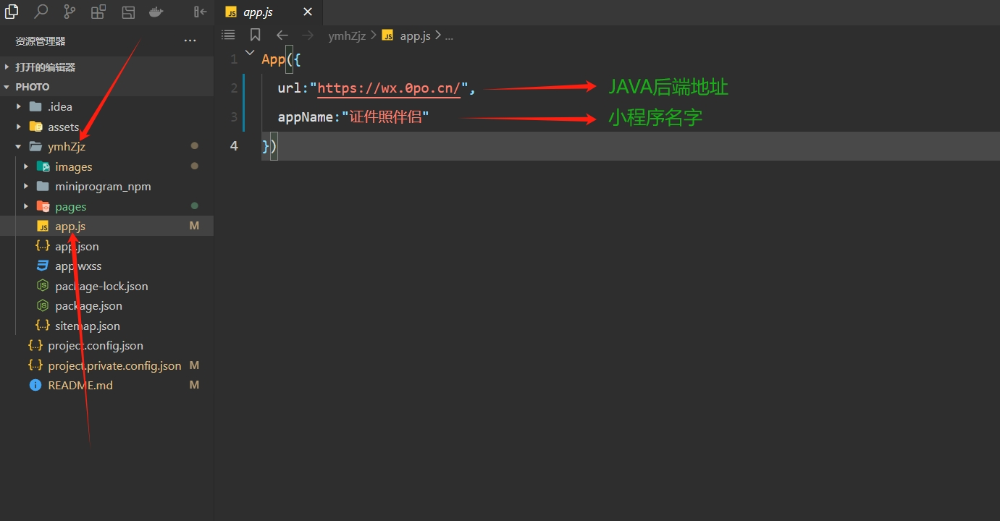
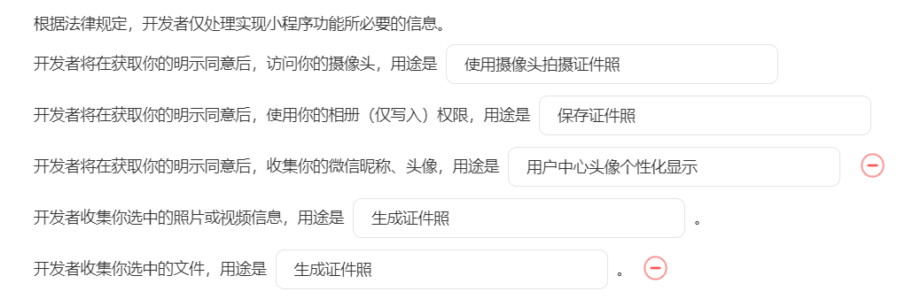

# 预览：

# 项目介绍

# 
证件照伴侣

我给你的，就是我想要的，我爱你的方式，就是我希望被爱的方式.

**相关项目**：
- 小程序前端另外一套请前往：https://github.com/no1xuan/ai-photo
- 小程序后端请前往：https://github.com/no1xuan/HivisionIDPhotos-wechat-weapp
- 小程序管理员网页后台请前往：https://github.com/no1xuan/zjzAdmin

------

# ⭐最近更新
- 2024.11.05: 增加登录失败时控制台打印错误原因，从此版本开始为长期稳定版本，基本不会频繁更新
- 2024.10.18: 修复高清照一直没生效的问题
- 2024.10.07: 增加管理员后台
- 2024.10.04: 修复高级参数dpi参数读取错误
- 2024.10.03: 修复自定义尺寸一直没生效的问题，修复部分传参错误
- 2024.10.02: 增加高级参数，美化页面，去除无用变量
- 2024.09.23: 增加个人中心，优化拍照技巧，优化定制尺寸，修复首点击部分功能会出现重复跳转2次的问题
- 2024.09.21: 修复我的作品无法下载问题
- 2024.09.20: 根据微信热力图优化体验，加大首页按钮点击范围，修复分页后删除作品页面没变化，增加温馨提示
- 2024.09.19: 增加看广告视频下载功能
- 2024.09.14: 根据群友建议缩短弹窗时间，修复白色背景生成出来是黑色的问题，修复离开小程序就掉登录的问题
- 2024.09.13: 根据微信热力图优化用户体验
- 2024.09.12: 第一个版本诞生
------

# 🔧部署

微信开发者工具打开项目后，修改一个地址就好啦

## 隐私协议

## 客服配置

## 📧其它

您可以通过以下方式联系我:

QQ: 24677102

微信：webxuan
